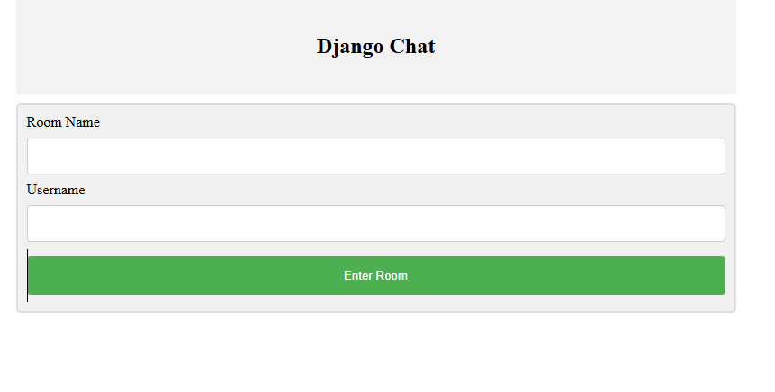
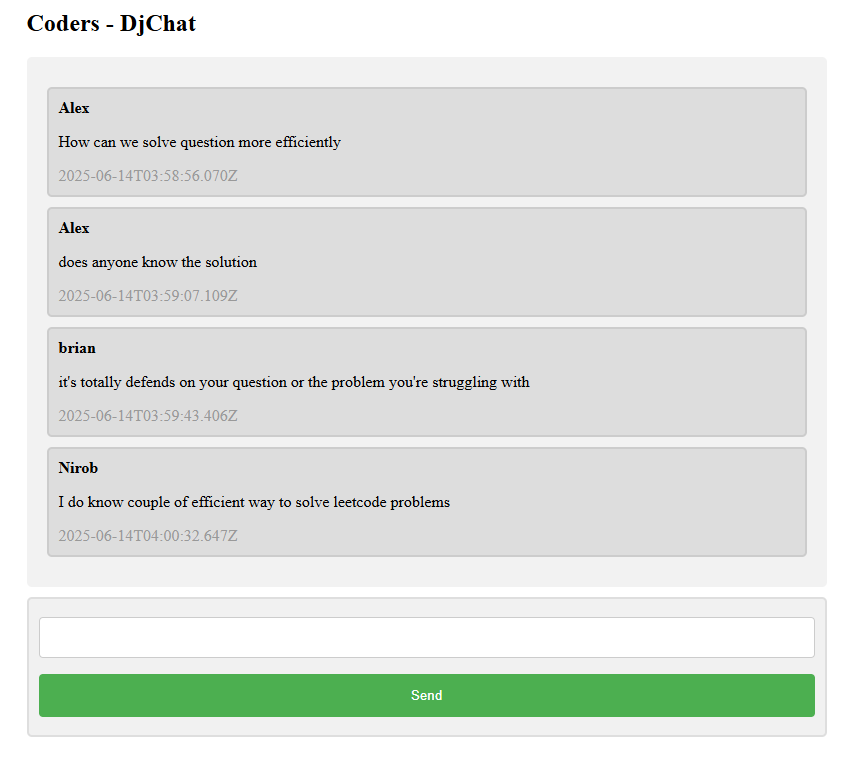

# 💬 Django Real-Time Chat App

This is a simple real-time chat web application built with Django. Users can enter a chat room by specifying a room name and a username. Messages are stored in the database and displayed live using AJAX polling.

🔗 GitHub Repo: [Realtime-Chat-App-with-django](https://github.com/SHAHRIAR-HOSSAIN-RIMON/Realtime-Chat-App-with-django)

---

## 🚀 Features

- 🔐 Join or create chat rooms with a username
- 💬 Real-time messaging using jQuery AJAX
- 🗃 Messages and rooms stored in SQLite3 database
- 🎨 Minimal UI built with HTML & CSS

---

## 📁 Project Structure

```
djangochat/
│
├── chat/                   # Core chat app
│   ├── migrations/
│   ├── __init__.py
│   ├── admin.py
│   ├── apps.py
│   ├── models.py           # Room and Message models
│   ├── views.py            # View logic
│   ├── urls.py             # App-specific routing
│   └── tests.py
│
├── djangochat/             # Project settings
│   ├── __init__.py
│   ├── settings.py
│   ├── urls.py
│   ├── asgi.py
│   └── wsgi.py
│
├── templates/              # HTML templates
│   ├── home.html           # Room entry page
│   └── room.html           # Chat interface
│
├── images/                 # Screenshots for README
│   ├── chat1.png           # Screenshot of home.html
│   └── chat2.png           # Screenshot of room.html
│
├── db.sqlite3              # SQLite database
├── manage.py               # Django management script
└── README.md               # Project documentation

```

---

## 🛠️ How to Run Locally

1. Clone the repository:

```bash
git clone https://github.com/SHAHRIAR-HOSSAIN-RIMON/Realtime-Chat-App-with-django.git
cd Realtime-Chat-App-with-django
```

2. Set up a virtual environment:

```bash
python -m venv venv
venv\Scripts\activate  # For Windows
# or
source venv/bin/activate  # For Mac/Linux
```

3. Install dependencies:

```bash
pip install django
```

4. Run migrations:

```bash
python manage.py makemigrations
python manage.py migrate
```

5. Start the development server:

```bash
python manage.py runserver
```

6. Open in your browser:

```
http://127.0.0.1:8000/
```

---

## ✨ How It Works

- Users enter a room name and username on the home page.
- A chat room is created if it doesn't exist.
- Messages sent in the room are stored in the database.
- jQuery periodically fetches new messages every second and updates the chat view.

---

## 📸 Preview

### 🏠 Home Page


### 💬 Chat Room


---

## 🧠 Built With

- Django
- SQLite3
- HTML + CSS
- JavaScript (jQuery + AJAX)

---

## 🔮 Future Features

- WebSocket support via Django Channels
- User authentication (Login/Register)
- Typing indicators
- Message deletion/editing

---

## 📜 License

MIT License – feel free to use and modify!
